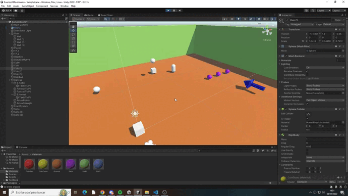
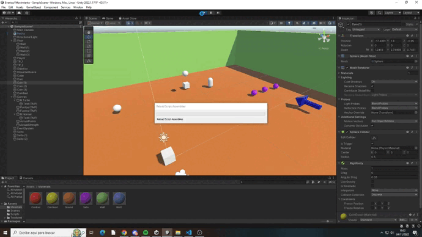
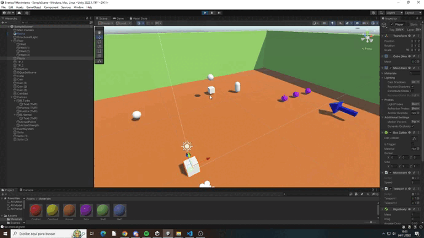
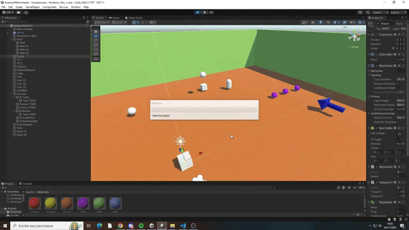
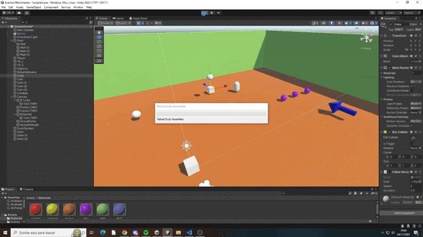
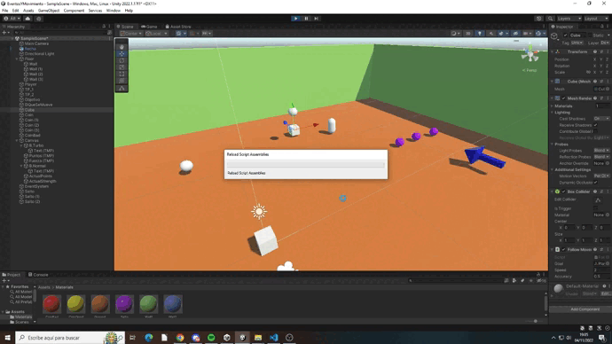

# Eventos y Movimiento rectilíneo.
## Autor: Álvaro González Rodríguez
alu0101202556

1. Crear un script para mover al objeto jugador con los ejes Horizontal y Vertical

Se ha creado un fichero Movement.cs que usando las teclas A D se mueve de forma horizontal y W S de forma vertical.

También mira la dirección a la que se mueve con la función Slerp de Quaternion.

2. Implementar una UI que permita configurar con qué velocidad te moverás: turbo o normal. También debe mostar la cantidad de objetos recolectados y si chocas con alguno especial restar fuerza.

La UI tiene 6 elementos, 2 botones y 4 cuadros de texto, siendo 2 actualizados cuando se interactua con los objetos requeridos.

Si se pulsa el botón turbo se inicializa el método *Turbo* que se encuentra en Movement.cs, lo mismo pasa para el botón normal.

Se ha creado un fichero llamado Points.cs que maneja el sistema de puntuación. Si se choca con un objeto de color amarillo se suma la misma cantidad que muestra fuerza, por lo que si se toca un objeto rojo se disminuye la fuerza en 25

3. Agregar a tu escena un objeto que al ser recolectado por el jugador haga que otro objetos obstáculos se desplacen de su trayectoria.

Se ha agregado dos ficheros nuevos, uno llamado Notificador, que se le ha asignado a una flecha de la escena, y otro Suscriptor, que se le han asignado a tres esferas violetas de la escena

Cuando el jugador toca la flecha se manda a volar con *AddForce* a las tres esferas de la escena

4. Agrega un objeto que te teletransporte a otra zona de la escena.

Se ha agrado un fichero llamado Teleport, el cual tiene referencia de los *Transform* de dos teletransportadores de la escena

Cuando se hace uso de uno de ellos se asigna la posición del jugador a la ubicación del otro teletransportador

5. Agrega un personaje que se dirija hacia un objetivo estático en la escena.

El código se encuentra en FollowStatic.cs

6. Agrega un personaje que siga el movimiento del jugador.

El código se encuentra en FollowMovement

Para que no siga el movimiento del jugador de forma vertical no se modifica su valor de la Y
